# ARGUS

> Локальный менеджер паролей с защитой от принуждения.

## 🚧 Первая версия — ищем тестеров!

Это **v0.0.1** — первая публичная сборка ARGUS. Проект **активно развивается**, и мне **очень важна обратная связь**.

**Попробуйте, поищите баги, оставьте отзыв:**
- 🐛 Нашли ошибку → создайте [Issue](https://github.com/argusvertex/argus-password-manager/issues)
- 💡 Есть идея → напишите в [Discussions](https://github.com/argusvertex/argus-password-manager/discussions)
- ⭐ Понравилось → поставьте звезду репозиторию

Любой фидбэк помогает сделать ARGUS лучше. Спасибо! 🙏

## 🔥 Возможности

- 🔒 **Полностью локально** — данные не покидают устройство.
- 🛡️ **Duress-пароль** — специальный пароль открывает пустое хранилище.
- 🔑 **Генератор паролей**.
- 📂 **Папки** для группировки.
- 📤 **Экспорт / импорт** JSON (любой формат) и CSV.
- 🌙 **Тёмная тема** в стиле киберпанк.
- 🎛️ **Сворачивается в трей**.
- 🚀 **Rust + Flutter** — быстро и безопасно.
- 💻 **Windows** (Linux/macOS в планах).

## 📦 Установка

**Скачай последний релиз:**
👉 **[ARGUS v0.0.1 — Releases](../../releases/latest)**

1. Скачай `ARGUS_Setup.exe` из раздела Releases
2. Запусти установщик
3. Открой ARGUS и создай мастер-пароль (минимум 8 символов)

При первом запуске — задай **мастер-пароль** (минимум 8 символов).

⚠️ **Мастер-пароль не восстанавливается.** Запомни его или запиши в надёжном месте.

## 🔐 Безопасность

- **Алгоритм шифрования:** ChaCha20-Poly1305
- **Ключ из пароля:** Argon2id (64 МБ памяти, 3 прохода)
- **Zero-Knowledge:** данные не уходят на серверы
- **Duress-пароль:** ввод специального пароля открывает **пустое** хранилище

## 🛠️ Технологии

- **Rust** — криптография, логика
- **Flutter** — интерфейс
- **flutter_rust_bridge** — связка

## 📄 Лицензия

## 📸 Скриншоты

### Экран входа
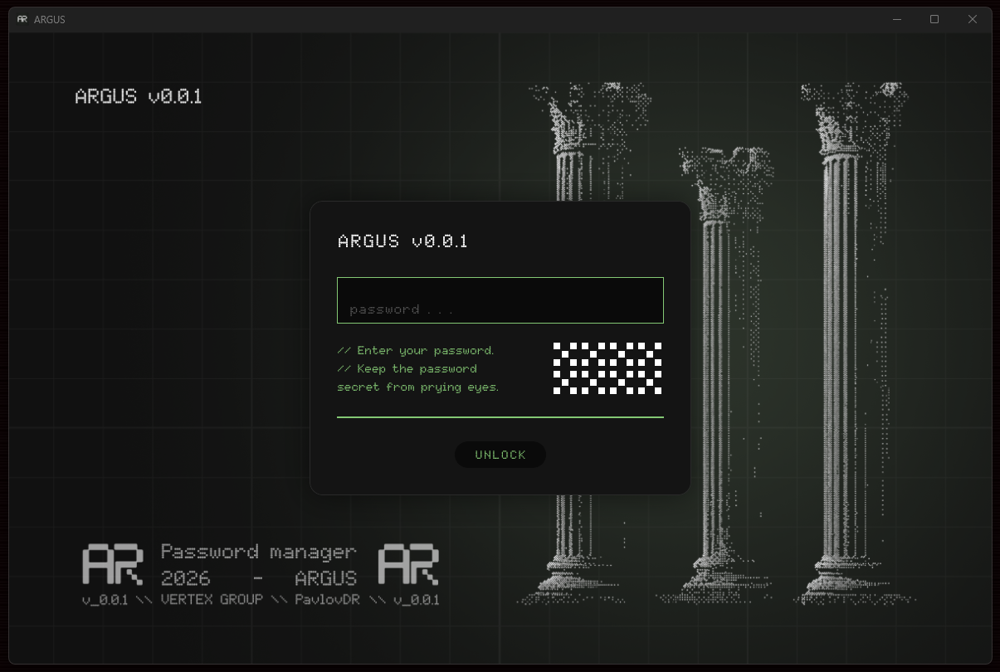

### Главный экран
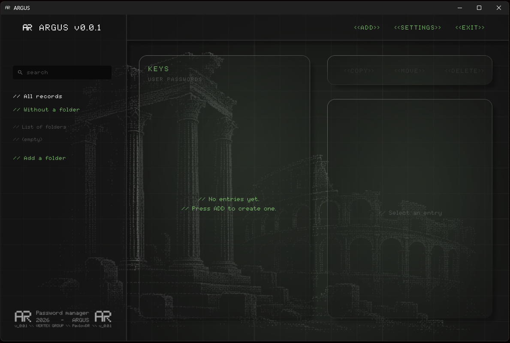

### Создание пароля
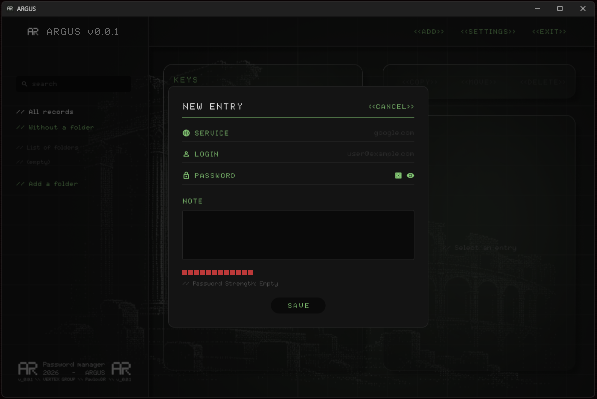

### Генерация пароля
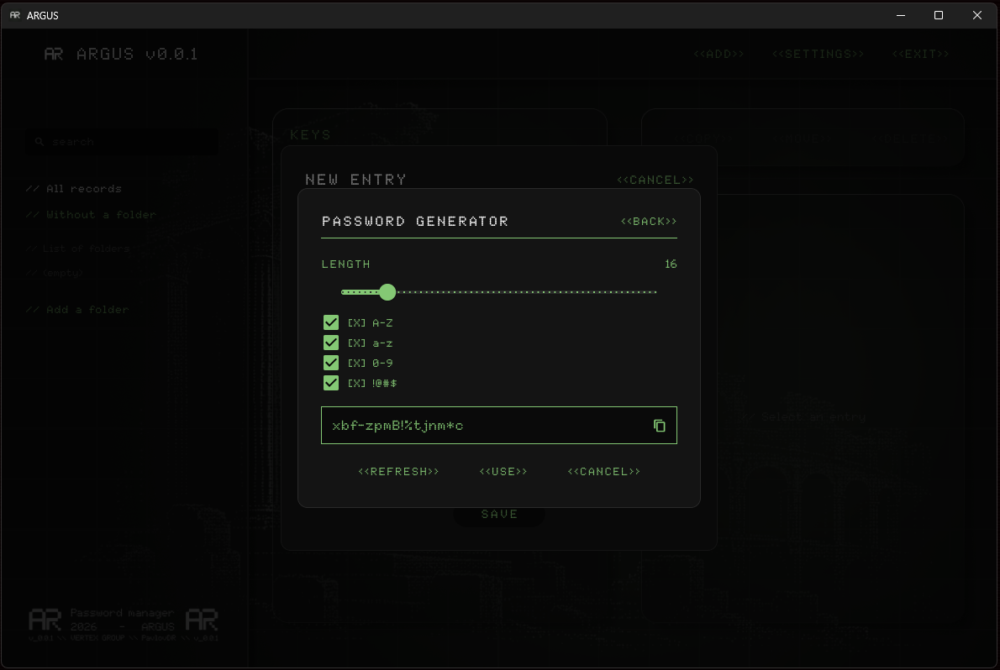

### Добавление записи
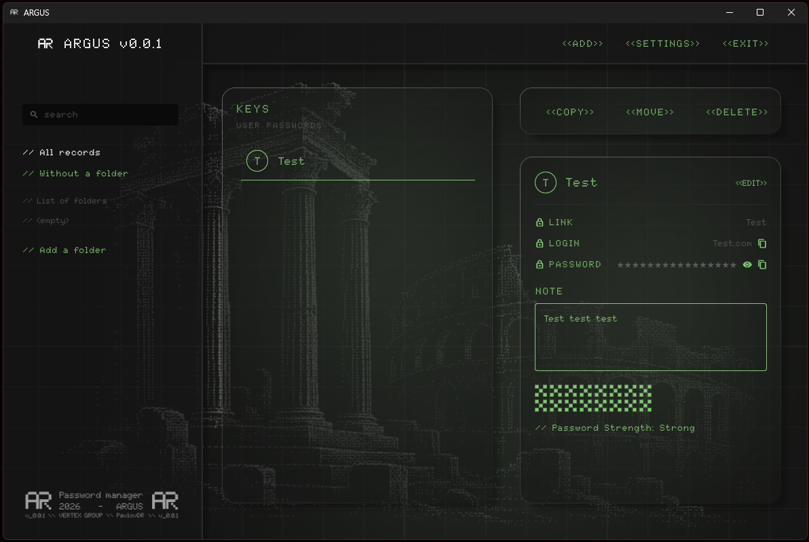

### Создание Папок
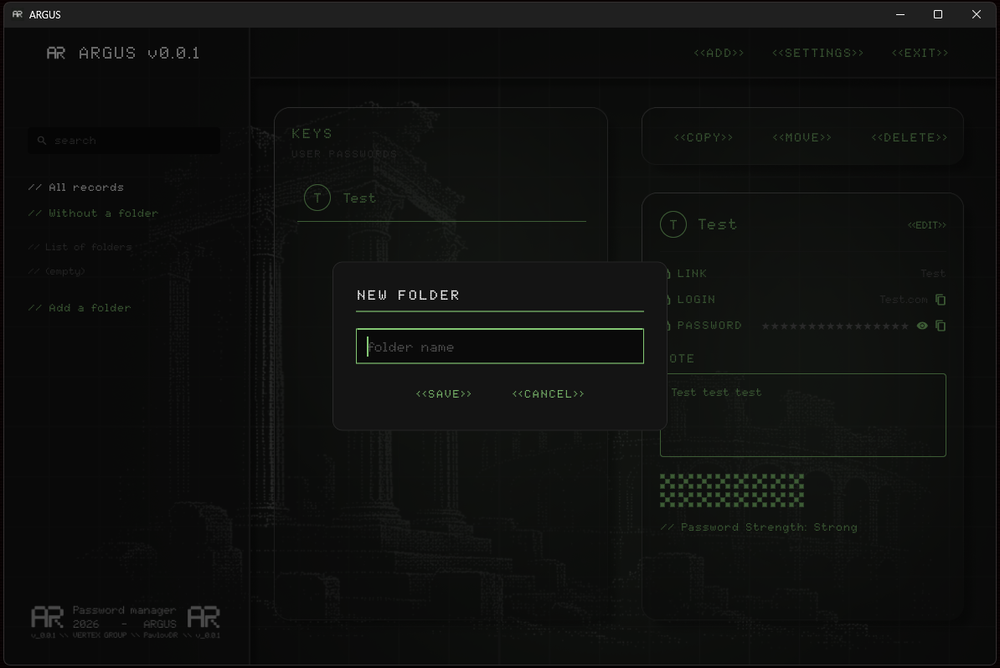

### Настройки
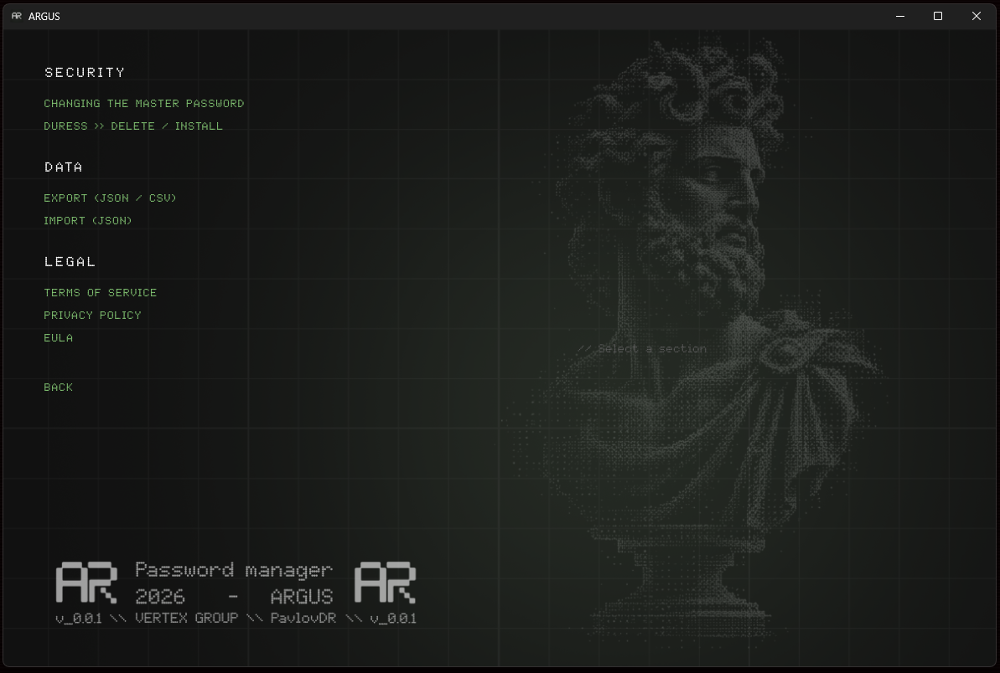

### Импорт

### Смена Пароля
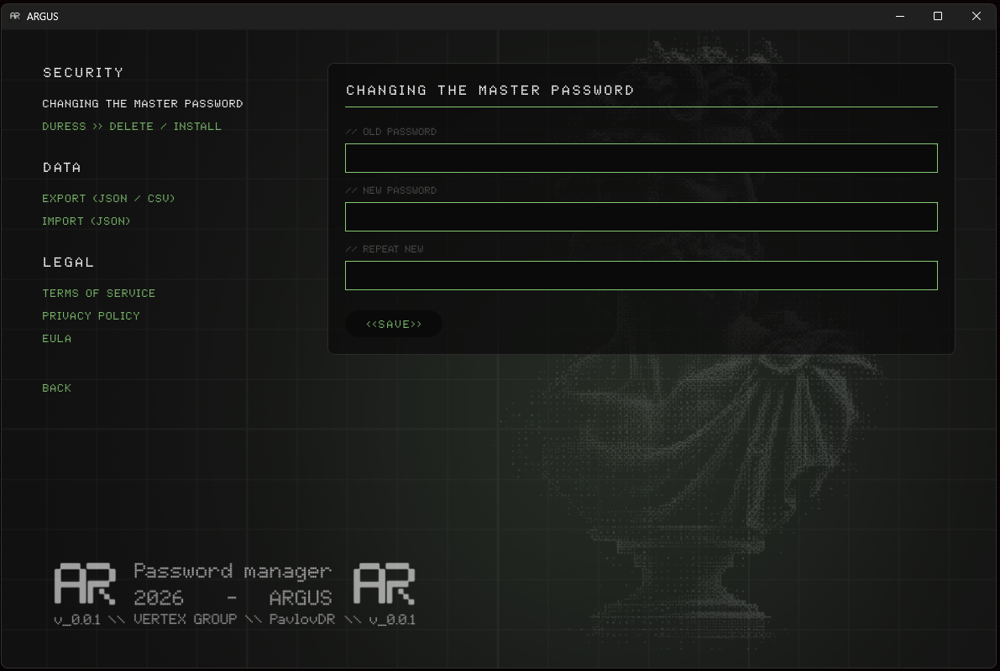

### Duress-пароль - ложное хранилище
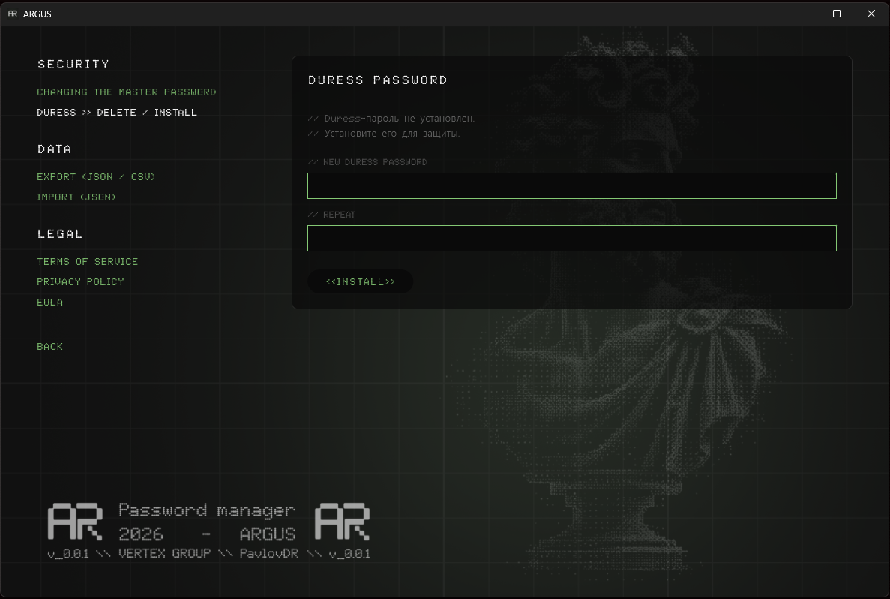

### Экспорт Паролей
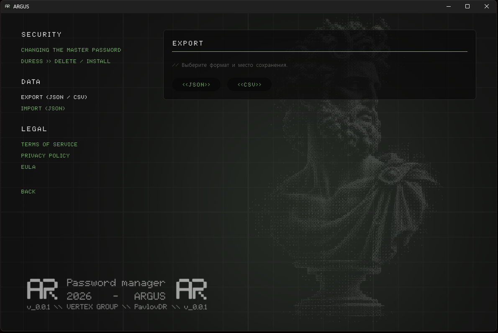

### Терms of Service
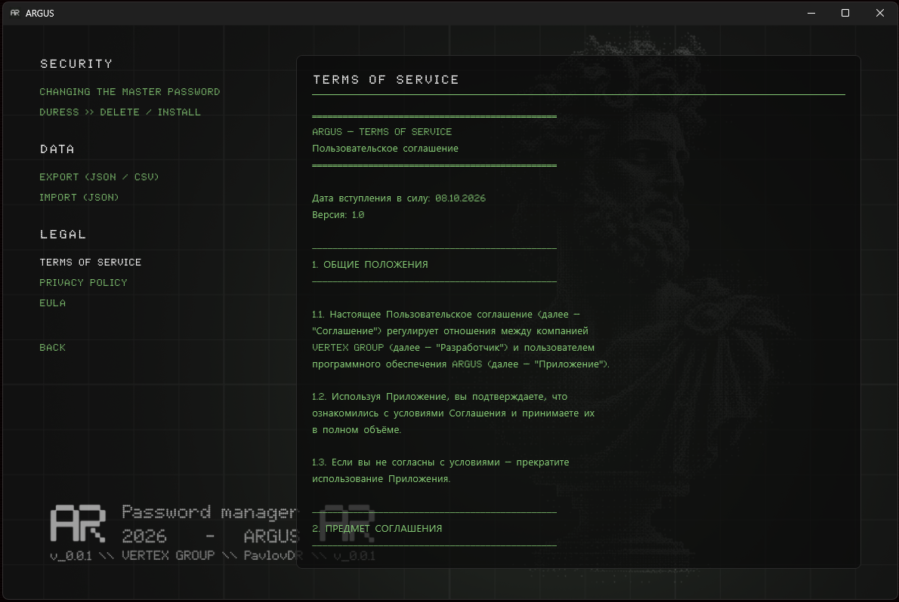

### Privacy Policy
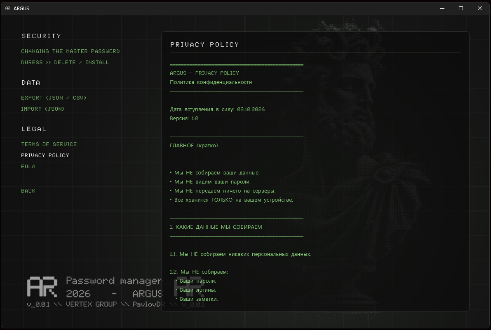

### О программе
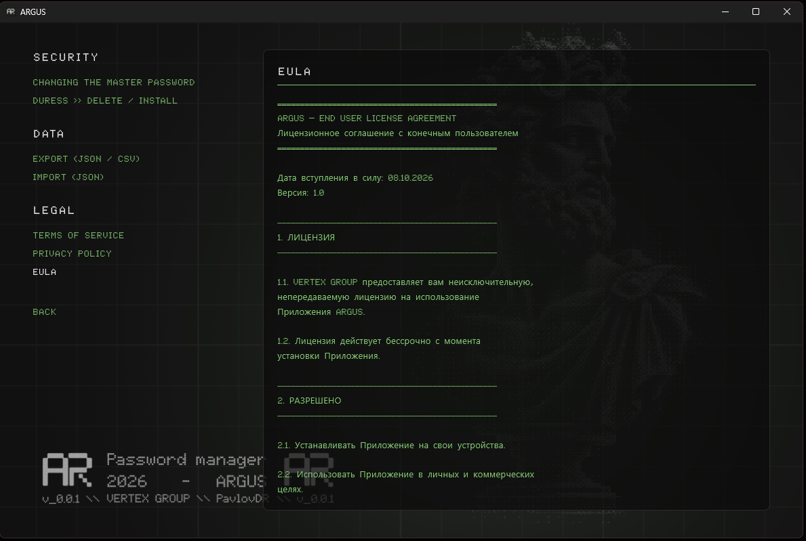

© 2026 VERTEX GROUP. Все права защищены.

Программа распространяется **как есть**. Используйте на свой риск.
