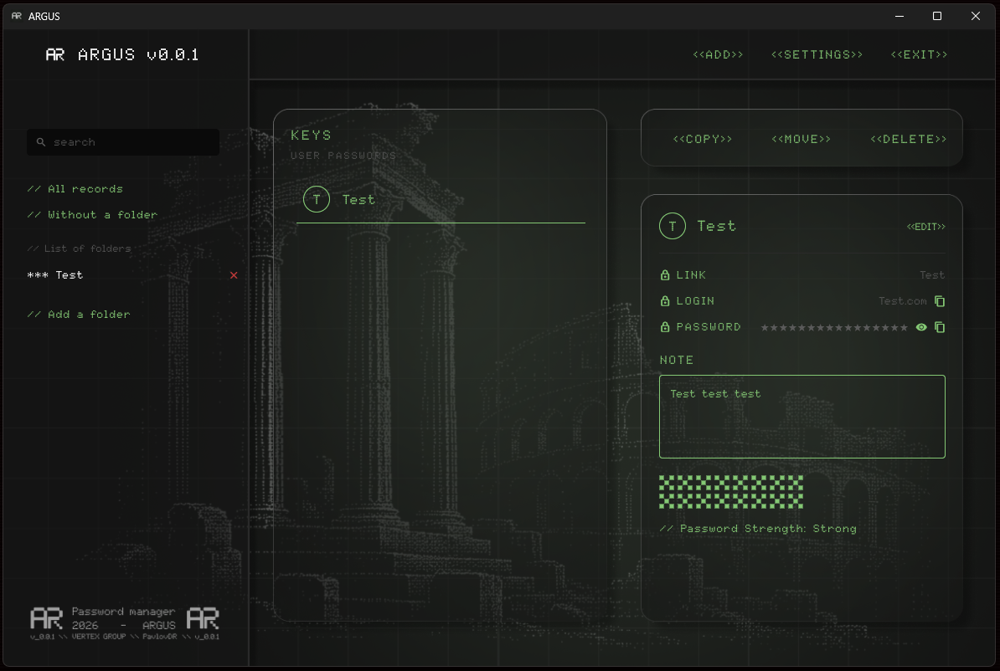

# ARGUS

> Локальный менеджер паролей с защитой от принуждения.

## 🚧 Первая версия — ищем тестеров!

Это **v0.0.1** — первая публичная сборка ARGUS. Проект **активно развивается**, и мне **очень важна обратная связь**.

**Попробуйте, поищите баги, оставьте отзыв:**
- 🐛 Нашли ошибку → создайте [Issue](../../issues)
- 💡 Есть идея → напишите в [Discussions](../../discussions)
- ⭐ Понравилось → поставьте звезду репозиторию

Любой фидбэк помогает сделать ARGUS лучше. Спасибо! 🙏

## 🔥 Возможности

- 🔒 **Полностью локально** — данные не покидают устройство.
- 🛡️ **Duress-пароль** — специальный пароль открывает пустое хранилище.
- 🔑 **Генератор паролей**.
- 📂 **Папки** для группировки.
- 📤 **Экспорт / импорт** JSON (любой формат) и CSV.
- 🌙 **Тёмная тема** в стиле киберпанк.
- 🎛️ **Сворачивается в трей**.
- 🚀 **Rust + Flutter** — быстро и безопасно.
- 💻 **Windows** (Linux/macOS в планах).

## 📦 Установка

1. Скачай последний установщик: **[Releases](../../releases/latest)**
2. Запусти `ARGUS_Setup.exe`.
3. Следуй инструкциям.

При первом запуске — задай **мастер-пароль** (минимум 8 символов).

⚠️ **Мастер-пароль не восстанавливается.** Запомни его или запиши в надёжном месте.

## 🔐 Безопасность

- **Алгоритм шифрования:** ChaCha20-Poly1305
- **Ключ из пароля:** Argon2id (64 МБ памяти, 3 прохода)
- **Zero-Knowledge:** данные не уходят на серверы
- **Duress-пароль:** ввод специального пароля открывает **пустое** хранилище

## 🛠️ Технологии

- **Rust** — криптография, логика
- **Flutter** — интерфейс
- **flutter_rust_bridge** — связка

## 📄 Лицензия

## 📸 Скриншоты

### Экран входа

### Главный экран

### Список паролей

### Детали записи

### Добавление записи

### Генератор паролей

### Настройки

### Смена мастер-пароля

### Duress-пароль

### Экспорт данных

### Импорт данных

### Юридические документы

### Терms of Service

### Privacy Policy

### О программе

© 2026 VERTEX GROUP. Все права защищены.

Программа распространяется **как есть**. Используйте на свой риск.
